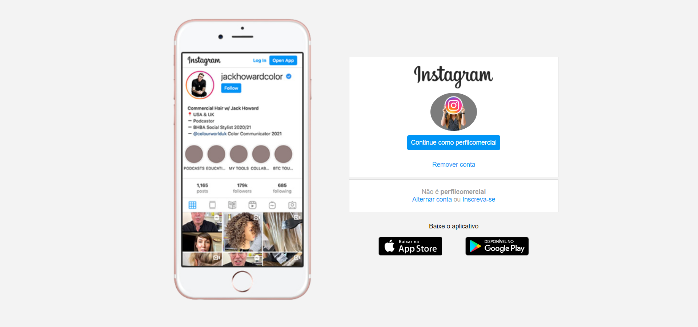

<h1 align="center"> Clone da Página Inicial do Instagram </h1>

Página web criada no Santander Bootcamp FullStack Developer da DIO - Digital Innovation One, com o intuito de aplicar os ensinamentos do modelo de layout Flexbox do CSS.

  <a href="#-tecnologias">Tecnologias</a>&nbsp;&nbsp;&nbsp;|&nbsp;&nbsp;&nbsp;
  <a href="#-projeto">Projeto</a>&nbsp;&nbsp;&nbsp;|&nbsp;&nbsp;&nbsp;
  <a href="#-layout">Layout</a>&nbsp;&nbsp;&nbsp;|&nbsp;&nbsp;&nbsp;
  <a href="#memo-licença">Licença</a>

 

  

## 🚀 Tecnologias

Esse projeto foi desenvolvido com as seguintes tecnologias:

- HTML 
- CSS

## 💻 Projeto

O projeto é um clone da página inicial do Instagram, onde foi aplicado o modelo de layout Flexbox do CSS, além do mais foi explorada a responsividade da página para uma melhor visualização em dispositivos móveis.

## 🔖 Layout

Você pode navegar pelo projeto através [DESSE LINK](https://thiagomonts.github.io/desafio-instagram-dio/).

## :memo: Licença

Esse projeto está sob a licença MIT.

---

Desenvolvido por [Thiago Honorato](https://www.linkedin.com/in/honoratothiago/)
